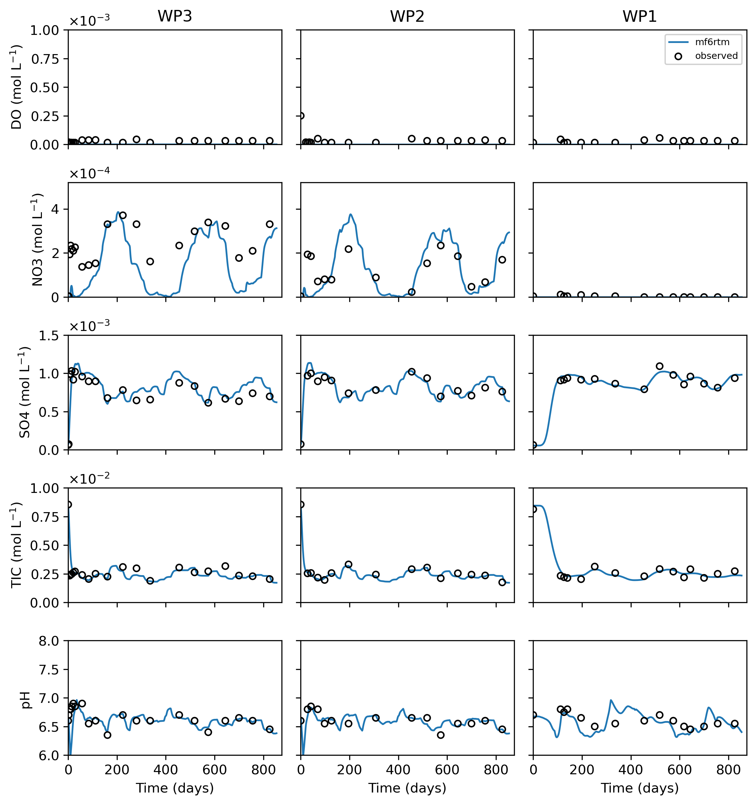
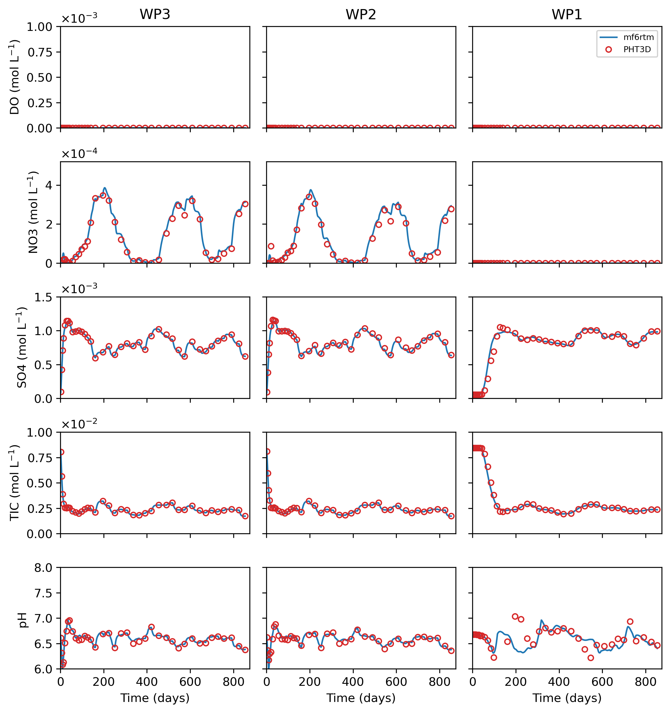
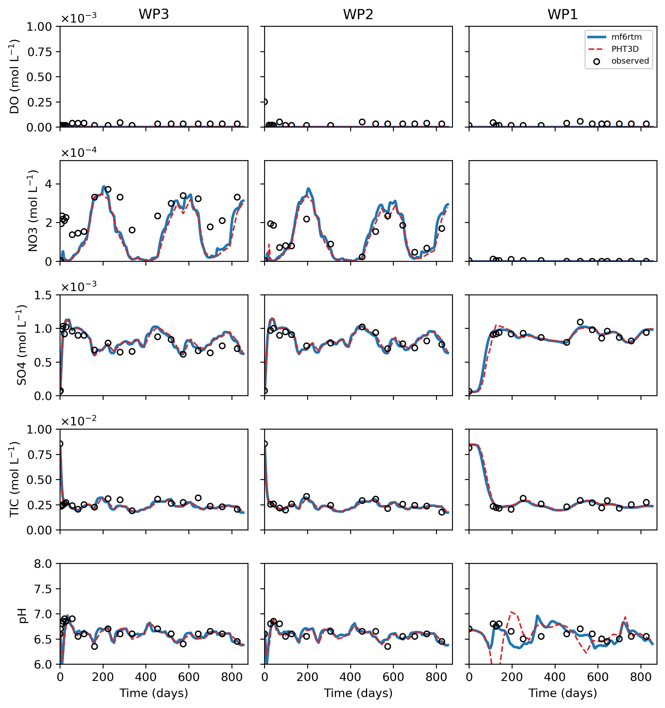

# DIZON 36

[](https://doi.org/10.5281/zenodo.23095990)

**Dizon 36** is a sandbox reactive transport model built to benchmark the
[`mf6rtm`](https://github.com/p-ortega/mf6rtm) code (MODFLOW 6 GWT coupled to PhreeqcRM) against
[PHT3D](https://www.pht3d.org) (MODFLOW-2005 + MT3DMS + PHREEQC-2), and to explore
decision-support workflows for reactive transport using machine-learning surrogates.

## The case study

The model reproduces the **Dizon deep well injection experiment** in the Netherlands, described by

> Prommer, H. & Stuyfzand, P. J. (2005) *Identification of Temperature-Dependent Water Quality
> Changes during a Deep Well Injection Experiment in a Pyritic Aquifer.* Environmental Science &
> Technology **39**(7), 2200–2209. [doi:10.1021/es0486768](https://doi.org/10.1021/es0486768)

Two Dutch water companies tested deep well recharge of canal water to combat groundwater
drawdown and restore wetlands. A pilot plant on the Zuid-Willemsvaart canal near Someren
injected pretreated, **aerobic** surface water at ~300 m depth into an **anoxic, pyritic**
aquifer. Injection ran from July 1996 to May 1999 — 854 days at 720 m³/day (days 0–726) and
960 m³/day thereafter — through injection well IP.2, with recovery at PP.1 98 m away and four
monitoring wells. Distances from IP.2: WP.3 at 8 m, WP.2 at 12 m, WP.1 at 38 m.

Injecting oxidants into pyrite drives the redox cascade that dominates the recovered water
quality. Pyrite oxidation was found to be the **main driver** of the water quality changes, and
its rate depended significantly on the seasonally varying groundwater temperature:

```
FeS2 + 3.75 O2 + 3.5 H2O  ->  Fe(OH)3 + 2 SO4(2-) + 4 H(+)
FeS2 + 3 NO3(-) + 2 H2O   ->  Fe(OH)3 + 2 SO4(2-) + 1.5 N2 + H(+)
CH2O + O2                 ->  HCO3(-) + H(+)
CH2O + 0.8 NO3(-)         ->  0.4 N2 + HCO3(-) + 0.2 H(+) + 0.4 H2O
CH2O + 0.5 SO4(2-)        ->  HCO3(-) + 0.5 H2S
```

**Temperature matters twice over.** Ambient groundwater sits near 17 °C while the injectant
cycled seasonally between 2 and 23 °C, and the paper reports that temperature fronts propagate
at roughly **half the velocity** of the chloride front. Heat is therefore modelled as a sorbing
solute with retardation `R_T = 1 + (1-θ)ρ_s k_s / (θ ρ_w k_w)`, and the pyrite and organic-matter
rate laws carry an Arrhenius temperature factor.

## Model setup

- **Grid / time:** structured, 12 layers × 16 rows × 33 columns; 39 stress periods over 854 days.
  A half-model exploiting the symmetry of the injection/extraction flow field, spanning the
  target aquifer between about −273 and −340 m depth. Injection concentrations vary per period
  (`data/wellin.csv`), producing the seasonal cycling visible in the figures below.
- **Conservative tracer:** chloride, with a clear contrast between background (2.54e-4 mol/L)
  and injection water (~1.6e-3 to 3.2e-3 mol/L). Cl agreement between codes is the first gate any
  comparison must pass.
- **Aqueous components (21):** Orgc, O(0), C(+4), C(−4), Ca, Cl, Fe(+2), Fe(+3), K, Mg, N(+3),
  N(+5), N(0), Na, S(−2), S(6), Si, Amm, Tmp, pH, pe.
- **Reactions:** equilibrium speciation and redox of the major ions, cation exchange on five
  exchangers (CaX₂, FeX₂, KX, MgX₂, NaX), sediment-bound immobile organic matter (`Orgmatter`)
  and ferrihydrite `Fe(OH)3` as equilibrium phases, and kinetic Pyrite and Orgc. The pyrite rate
  follows Williamson & Rimstidt, `r_pyr ∝ C_O2^0.5 · C_H+^-0.11 · (m/m0)^0.67`, extended for
  oxidation by nitrate and scaled by the Arrhenius factor.
- **Thermodynamic database:** `data/datab.dat`, shared by both codes.

> **Note — Ferrihydrite.** `Fe(OH)3` is the *product* of both pyrite oxidation reactions above, and
> the source paper includes mineral equilibrium for it, so it is enabled here (`eq_keys` in
> `initialize_chemistry`, matched by the type-D rows in `pht3d_species_csv`). Its `m0` is 0 in every
> layer of `ic_surfaces.csv`, so it acts as a precipitate-only sink for the Fe(3) that pyrite
> oxidation releases. **The N and redox parameters were fitted while it was absent**, so they are
> not re-tuned for it: enabling it improves the NO₃ and SO₄ fit slightly but degrades the pH fit
> (RMSE 0.158 → 0.194). A recalibration with it on is outstanding.

## Code comparison

The two codes agree closely. Late-time (t ≥ 400 d) mf6rtm ÷ PHT3D ratios at WP2/WP3 are
1.07–1.09 for NO₃ and ~1.00 for SO₄, TIC and pH, and the conservative chloride front matches to
~0.5 % RMS.

The one remaining discrepancy is pH at WP1, the well furthest from the injection point. Outside the
reactive front the two codes agree to a mean 0.064 pH units, but during the front's passage
(100–240 d) PHT3D swings to 4.7 then 7.0 where mf6rtm stays between 6.3 and 6.7 — the acid pulse
from `Fe(OH)3` precipitation, which the codes time differently because mf6rtm transports total
elements and lets PHREEQC redistribute valence each step while PHT3D transports the individual
redox states. Note the pH row is clipped at 6, so that excursion runs off the bottom of the axis.

**mf6rtm** is the solid blue line and **observations** are open circles throughout. **PHT3D** is a
dashed red line where the observations are also shown, and open circles where it is compared
against mf6rtm alone. Rows are DO / NO₃ / SO₄ / TIC / pH; columns are WP3 / WP2 / WP1, screen `f2`.

### mf6rtm vs observations


### mf6rtm vs PHT3D


### mf6rtm vs observations vs PHT3D


## Workflow

Everything runs from `workflow.py`, controlled by boolean flags on `main()`. `python workflow.py`
builds and runs the structured mf6rtm model and writes the three figures above. That run takes
about 35 minutes and writes a 2.9 GB `model/reactive/sout.csv`.

```python
main(
    prep_obs        = False,  # clean the raw observation CSVs
    run_base        = False,  # build + run the unstructured mf6rtm model
    run_base_struct = True,   # build + run the structured mf6rtm model (model/reactive)
    build_pht3d     = False,  # PHT3D twin: MF2005 flow twin + FTL, species table, MT3DMS deck
    run_pht3d       = False,  # run the PHT3D binary (~9 min)
    extract_pht3d   = False,  # PHT3D UCNs -> data/pht3dout.csv
    figures         = True,   # write the three comparison figures above
    prep_pest       = False,  # prepare the PEST++ setup
    run_pest        = False,  # run PEST++
)
```

The PHT3D model build is derived from the mf6rtm run in `model/reactive`, so run `run_base_struct`
first. `build_pht3d` gates the MODFLOW-2005 flow twin against the MF6 heads before building
transport on its flow-transport link file.

## Dependencies

- [pestpp](https://github.com/usgs/pestpp)
- [pyemu](https://github.com/pypest/pyemu) — vendored at `dependencies/pyemu`, installed editable
- [mf6rtm](https://github.com/p-ortega/mf6rtm) — vendored at `dependencies/mf6rtm` (0.5.1),
  installed editable
- [PHT3D-FSP](https://github.com/SLS-github/PHT3D-FSP) — vendored at `dependencies/pht3d_fsp`,
  patched to read a CSV species table instead of `.xlsx`

Executables (`mf6`, `libmf6`, `mf2005`, `mt3dms`, `pht3d`, `pestpp-*`) live in `bin/mac`.

```bash
conda env create -f environment.yml
conda activate dizon36
```
